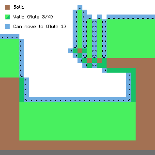

# Robot API
This API wraps the functionality of the **component** [robot](../component/robot.md) to allow more intuitive interaction with the robot.

This is the api you are using when in your lua code you call

```lua
local robot_api = require("robot")
robot_api.forward()
```

As opposed to using the robot component api directly, via the component interface

```lua
local component = require("component")
local robot_component_api = component.robot -- if using openos, else component.proxy(component.list("robot")())
robot_component_api.move(sides.front)
```

While the component robot has more generic functions like `move([side: number])` or `drop([side: number])`, this API has more intuitive and failsafe functions like `turnRight`, `dropDown`, `forward`. Which one you use is up to you, you can even use both at the same time.

Note that a Robot is also computer like any other with just an additional robot component included, so the normal [APIs](../api.md) are available as usual.

See [Robot Block](../block/robot.md) for additional information on the actual Robot.

### Slot alignment

### Movement

Robots are capable of complex movements, but some you may want to understand some nuances.

#### Hovering
Robots have a flight-height limitation. The general movement rules for robots go like this:

- 1. Robots may only move if the start or target position is valid (e.g. to allow building bridges).
- 2. The position below a robot is always valid (can always move down).
- 3. Positions up to `flightHeight` above a solid block are valid (limited flight capabilities, default is 8).
- 4. Any position that has an adjacent block with a solid face towards the position is valid (robots can "climb").
Here's an image visualizing that (minus the second rule, because that'd just clutter it).



Violating these rules will result in a the error `impossible move` to be returned

You can install hover upgrades to increase (tier 1) and pretty much circumvent (tier 2) this limitation. Or you can disable this in the config, by setting `limitFlightHeight` to 256 or so.

[source](https://github.com/MightyPirates/OpenComputers/issues/1113#issuecomment-97731965)

### API Exclusive Methods

- `robot.name(): string`
Returns the robot's name.
The name of a Robot is set initially during it's creation and cannot be changed programmatically. However you can change it using an anvil if you want.
- `robot.detect(): boolean, string`
Detects what is directly in front of the robot and returns if the robot could move through it as well as a generic description.
**Returns:** `true` if the robot if whatever is in front of the robot would prevent him from moving forward (a block or an entity) (Note: Drones return `true` even if the block is `passable`), `false` otherwise. The second parameter describes what is in front in general and is one of either `entity`, `solid`, `replaceable`, `liquid`, `passable` or `air`.
- `robot.detectUp(): boolean, string`
As `robot.detect()` except that it scans the block directly above the robot.
- `robot.detectDown(): boolean, string`
As `robot.detect()` except that it scans the block directly below the robot.
- `robot.select([slot: number]): number`
Selects the given inventory slot (if specified) and returns the current inventory slot.
**slot** - the slot to select. If this parameter is omitted, no slot is selected.
**Returns** the currently selected slot. Either the one specified (if successfully selected) or the one that was previously selected.
- `robot.inventorySize(): number`
**Returns** the amount of select-able internal robot inventory slots. To get the number of
inventory upgrade use: x = robot.inventorySize() / 16.
- `robot.count([slot: number]): number`
Returns the amount of items currently in the specified or selected slot.
**slot** - specifies the slot to count the items in. If omitted the currently selected slot is counted instead.
**Returns** the amount of items in the slot specified or the currently selected slot if no slot was given.
- `robot.space([slot: number]): number`
Returns the amount of items that can still be added to the specified slot until it is filled up.
**slot** - specifies the slot to count the items in. If omitted the currently selected slot is counted instead.
**Returns** the amount of items that can still be added to the the slot specified or the currently selected slot until it is considered full.
This function helps to determine how many items of a type can be added to a specific slot. While for example cobblestone can pile up to 64 items per slot, empty buckets can only stack up to 16 and other blocks like doors can only take 1 item per slot.
- `robot.transferTo(slot: number[, count: number]): boolean`
Moves all or up to *count* items from the currently selected slot to the specified slot.
**slot** - specifies the slot move the items from the currently selected slot to.
**count** - if specified only up to this many items are moved, otherwise the entire stack is moved.
**Returns** `true` if exchanging the content between those slots was successful, `false` otherwise.
If there are items in the target slot then this function attempts to swap the items in those slots. This only succeeds if you move all items away from the current slot or if the current slot was empty anyways.
Note that this will always return true if the specified slot is the same as the currently selected slot, or if both slots are empty, even though no items are effectively moved.
- `robot.compareTo(slot: number): boolean`
Compares the item of the currently selected slot to the item of the slot specified and returns whether they are equal or not.
**slot** - specifies the slot to compare the current slot to.
**Returns** `true` if the item type in the specified slot and the currently selected slot are equal, `false` otherwise.
Two items are considered the 'same' if their item type and metadata are the same. Stack size or any additional mod-specific item informations (like for example the content of two floppy disks) are not checked.
- `robot.compare(): boolean`
Compares the block in front of the robot with the item in the currently selected slot and returns whether they are the same or not.
Blocks are considered the 'same' if their type and metadata are the same. Stack size or any additional informations (like for example the inventory of a container) are not checked.
Note that empty space in front of the robot is considered an 'air block' by the game, which cannot be put into an inventory slot and therefore compared by normal means. An empty slot and an air block are **not** the same. You can use `robot.detect()` beforehand to determine if there is actually a block in front of the robot.
Also keep in mind that blocks that drop items need to be compared to the actual same block that is in the world. For example stone blocks drop as cobblestone and diamond ores drop diamond items, which are not the same for this function. Use silk-touch items to retrieve the actual block in the world for comparison.
- `robot.compareUp(): boolean`
As `robot.compare` just for the block directly above the robot.
- `robot.compareDown(): boolean`
As `robot.compare` just for the block directly below the robot.
- `robot.drop([count: number]): boolean`
Tries to drop items from the currently selected inventory slot in **front** of the robot. Note that if you are trying to drop items into an inventory below you, this is the wrong method. Use `dropDown` for that case. This method, `drop`, will drop the items to the **front**.
**count** - specifies how many items to drop. If omitted or if count exceeds the amount of items in the currently selected slot, then all items in the currently selected slot are dropped.
**Returns** `true` if at least one item was dropped, `false` otherwise.
If the block or entity (like chests or mine-carts with a chest) immediately in front of the robot has an accessible item inventory, the robot will try to put those items into this inventory instead of throwing them into the world. If the block in front has an inventory but the item could not be moved into it for any reason, then this function returns false and does not move any items. Where the item will be put on depends on the inventory and the side the robot is facing. Furnaces for example receive items to smelt from the top side. Also note that robots are considered "blocks with an inventory" as well and therefore items can be moved into robot slots as with any other inventory as well.
This function cannot interact with non-item inventories (like for example fluid tanks) and will not consider them an inventory and therefore items will be thrown into the world instead. You need to use the `robot.use` function to interact with those types of blocks.
Note that this will always return false, if the currently selected slot contains no items at all.
- `robot.dropUp(): boolean`
As `robot.drop` just for the block directly above the robot.
- `robot.dropDown(): boolean`
As `robot.drop` just for the block directly below the robot.
- `robot.suck([count: number]): boolean`
Tries to pick up items from directly in front of the robot and puts it into the selected slot or (if occupied) first possible slot.
**count** - limits the amount of items to pick up by this many. If omitted a maximum of one stack is taken.
**Returns** `true` if at least one item was picked up, false otherwise.
This is basically the inverse of `robot.drop` and will interact with item inventories in the same way. However this will only take the first item available in that inventory. For more precise inventory management you need to install an [inventory controller upgrade](../item/inventory_controller_upgrade.md) into the robot.
If there are multiple items in front of the robot, this will pick them up based on the distance to the robot. This will skip items that cannot be picked up for whatever reason and try other items first before returning `false`.
If the currently selected slot contains a different item than the one the robot tries to pick up, the robot will attempt to place the item in the next possible slots *after* the selected one that are either free or contain identical items with less than the maximum stack size for those items. This will distribute the items to pick up over several slots if necessary. If no slot after the selected one is able to contain the items the robot tries to put up, this function will fail, even if there are slots *before* the currently selected slot that could hold those items.
- `robot.suckUp([count: number]): boolean`
As `robot.suck` except that it tries to pick up items from directly above the robot.
- `robot.suckDown([count: number]): boolean`
As `robot.suck` except that it tries to pick up items from directly below the robot.
- `robot.place([side: number[, sneaky: boolean]]): boolean[, string]`
Tries to place the block in the currently selected inventory slot in front of the robot.
**side** - if specified this determines the surface on which the robot attempts to place the block for example to place torches to a specific side. If omitted the robot will try all possible sides. See the [Sides API](sides.md) for a list of possible sides.
**sneaky** - if set to `true` the robot will simulate a sneak-placement (like if the player would be using shift during placement), which is usually not necessary and only included for compatibility to other mods.
**Returns:** `true` if an item could be placed, `false` otherwise. If placement failed, the secondary return parameter will describe why the placement failed.
A robot can only place blocks to the side of another solid block, they cannot place blocks "into the air" without an [Angel upgrade](../item/angel_upgrade.md). This can be changed in the config file.
Note that trying to place an empty inventory slot will always fail.
- `robot.placeUp([side: number[, sneaky: boolean]]): boolean[, string]`
As `robot.place` except that the robot tries to place the item into the space directly above it.
- `robot.placeDown([side: number[, sneaky: boolean]]): boolean[, string]`
As `robot.place` except that the robot tries to place the item into the space directly below it.
- `robot.durability(): number, number, number or nil, string`
Returns the durability of the item currently in the tool slot, followed by its current durability, followed by its maximum durability.
If no item is equipped or the item has no durability this returns `nil` and an error message describing why no durability could be returned. The error message is one of `no tool equipped` or `tool cannot be damaged`.
- `robot.swing([side: number, [sneaky:boolean]]): boolean[, string]`
Makes the robot use the item currently in the tool slot against the block or space immediately in front of the robot in the same way as if a player would make a left-click.
**side** - if given the robot will try to 'left-click' only on the surface as specified by side, otherwise the robot will try all possible sides. See the [Sides API](sides.md) for a list of possible sides.
**Returns:** true if the robot could interact with the block or entity in front of it, false otherwise. If successful the secondary parameter describes what the robot interacted with and will be one of 'entity', 'block' or 'fire'.
This can be used to mine blocks or fight entities in the same way as if the player did a left-click. Note that tools and weapons do lose durability in the same way as if a player would use them and need to be replaced eventually. Items mined or dropped of mobs will be put into the inventory if possible, otherwise they will be dropped to the ground.
Note that even though the action is performed immediately (like a block being destroyed) this function will wait for a while appropriate to the action performed to simulate the time it would take a player to do the same action. This is most noticeable if you try to mine obsidian blocks: they are destroyed and put into the inventory immediately, but the function will wait for a few seconds.
If this is used to mine blocks, then the tool equipped needs to be sufficient to actually mine the block in front. If for example a wooden pick-axe is used on an obsidian block this will return false. Everything (including an empty slot) can be used to fight mobs, but the damage will be based on the item used. Equally everything can be used to extinguish fire, and items with durability will not lose any if done so.
- `robot.swingUp([side: number, [sneaky:boolean]]): boolean[, string]`
As `robot.swing` except that the block or entity directly above the robot will be the target.
- `robot.swingDown([side: number, [sneaky:boolean]]): boolean[, string]`
As `robot.swing` except that the block or entity directly below the robot will be the target.
- `robot.use([side: number[, sneaky: boolean[, duration: number]]]): boolean[, string]`
Attempts to use the item currently equipped in the tool slot in the same way as if the player would make a right-click.
**side** - if given the robot will try to 'right-click' only on the surface as specified by side, otherwise the robot will try all possible sides. See the [Sides API](sides.md) for a list of possible sides.
**sneaky** - if set to `true` the robot will simulate a sneak-right-click (like if the player would be using shift during a right-click). Some items (like buckets) will behave differently if this is set to true.
**duration** - how long the item is used. This is useful when using charging items like a bow.
**Returns:** true if the robot could interact with the block or entity in front of it, false otherwise. If successful the secondary parameter describes what the robot interacted with and will be one of 'block_activated', 'item_placed', 'item_interacted' or 'item_used'.
This function has a very broad use as the robot can simulate right-clicks with most items. The only difference to players is that the robot cannot use items that specifically require the user to be an entity as the robot is a block. So drinking potions, eating food or throwing an ender pearl will fail.
This functions secondary return value can be used to determine what the result of the right-click caused. Which of the item results is returned is not always obvious and requires some testing beforehand. Also note that while robots are not affected by harmful potions they can be destroyed by explosions, so be careful when you place, throw or activate any form of explosives with this function. Possible values for the second return value:
  - `block_activated` - a block was activated (like levers, switches or doors).
  - `item_interacted` - the equipped tool interacted with the world, for example sheers when used on a sheep.
  - `item_placed` - something was placed into the world. This is not only caused by placeable blocks, but as well by items that cause blocks or entities to appear in the world (like flint and stone or mob eggs).
  - `item_used` - the equipped was activated, like a splash-potion.
  - `air` - the equipped item requires a target but there was none. Note that if your robot has an Angel upgrade, this will never be returned, however some actions might still cause no effect.
- `robot.useUp([side: number[, sneaky: boolean[, duration: number]]]): boolean[, string]`
As `robot.use` except that the item is used aiming at the area above the robot.
- `robot.useDown([side: number[, sneaky: boolean[, duration: number]]]): boolean[, string]`
As `robot.use` except that the item is used aiming at the area below the robot.
- `robot.forward(): boolean[, string]`
Tries to move the robot forward.
**Returns:** `true` if the robot successfully moved, `nil` otherwise. If movement fails a secondary result will be returned describing why it failed, which will either be 'impossible move', 'not enough energy' or the description of the obstacle as `robot.detect` would return.
The result 'not enough energy' is rarely returned as being low on energy usually causes the robot to shut down beforehand.
The result 'impossible move' is kind of a fall-back result and will be returned for example if the robot tries to move into an area of the world that is currently not loaded.
- `robot.back(): boolean[, string]`
As `robot.forward()` except that the robot tries to move backward.
- `robot.up(): boolean[, string]`
As `robot.forward()` except that the robot tries to move upwards.
- `robot.down(): boolean[, string]`
As `robot.forward()` except that the robot tries to move downwards.
- `robot.turnLeft()`
Turns the robot 90° to the left.
Note that this can only fail if the robot has not enough energy to perform the turn but has not yet shut down because of it.
- `robot.turnRight()`
As `robot.turnLeft` except that the robot turns 90° to the right.
- `robot.turnAround()`
This is the same as calling `robot.turnRight` twice.
- ~~`robot.level(): number`~~
**Deprecated since OC 1.3** use `component.experience.level()` instead (only available if the [experience upgrade](../item/experience_upgrade.md) is installed).
Returns the current level of the robot, with the fractional part being the percentual progress towards the next level. For example, if this returns `1.5`, then the robot is level one, and 50% towards achieving level two.
- `robot.tankCount():number`
  The number of tanks installed in the robot.
- `robot.selectTank(tank)`
  Select the specified tank. This determines which tank most operations operate on.
- `robot.tankLevel([tank:number]):number`
  The the current fluid level in the specified tank, or, if none is specified, the selected tank.
- `robot.tankSpace():number`
  The the remaining fluid capacity in the specified tank, or, if none is specified, the selected tank.
- `robot.compareFluidTo(tank:number):boolean`
  Tests whether the fluid in the selected tank is the same as in the specified tank.
- `robot.transferFluidTo(tank:number[, count:number]):boolean`
  Transfers the specified amount of fluid from the selected tank into the specified tank. If no volume is specified, tries to transfer 1000 mB.
- `robot.compareFluid():boolean`
  Tests whether the fluid in the selected tank is the same as in the world or the tank in front of the robot.
- `robot.compareFluidUp():boolean`
  Like `compareFluid`, but operates on the block above the robot.
- `robot.compareFluidDown():boolean`
  Like `compareFluid`, but operates on the block below the robot.
- `robot.drain([count:number]):boolean`
  Extracts the specified amount of fluid from the world or the tank in front of the robot. When no amount is specified, will try to drain 1000 mB. When the drained fluid is in the world and it cannot be fully stored in the selected tank, the operation fails, i.e. no fluid is lost.
- `robot.drainUp([count:number]):boolean`
  Like `drain`, but operates on the block above the robot.
- `robot.drainDown([count:number]):boolean`
  Like `drain`, but operates on the block below the robot.
- `robot.fill([count:number]):boolean`
  Injects the specified amount of fluid from the selected tank into the the world or the tank in front of the robot. When no amount is specified, will try to eject 1000 mB. When there is not enough fluid to fill a block, or the target tank does not have enough room, the operation fails, i.e. no fluid is lost.
- `robot.fillUp([count:number]):boolean`
  Like `fill`, but operates on the block above the robot.
- `robot.fillDown([count:number]):boolean`
  Like `fill`, but operates on the block below the robot.

## Contents
