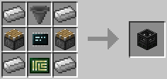

# 3D Printer

3D Printers are a block that allows you to print any block of any shape, with any type of texture. To get started with 3D Printers, you will need to place down a 3D Printer block next to a computer. This will give access to the [printer3d component](../component/3d_printer.md) API, allowing you to set up and print models using the provided functions.

A more convenient way to setup 3D Printers is to use [Open Programs Package Manager (OPPM)](../tutorial/program_oppm.md). Once installed, run the following commands: `oppm install print3d` followed by `oppm install print3d-examples`. The examples can be found in `/usr/share/models/` as `.3dm` files. Take a look through the example files for available options. (Alternatively, you can download the `print3d` and `print3d-examples` programs from [OpenPrograms](https://openprograms.github.io/) using `wget` and an [Internet Card](../item/internet_card.md)).

In order to be able to print the models, a 3D Printer block needs to be connected to an existing computer. Once connected, you will also need to provide an [Ink Cartridge](../item/ink_cartridge.md) and some [Chamelium](../item/materials.md). The amount of chamelium used depends on the volume of the 3D print, while the amount of ink used depends on the surface area of the printed item.

To print an item, use the following command: `print3d /path/to/file.3dm` providing the path to the `.3dm` file.

Documentation pertaining to creating your own models can be found in `/usr/share/models/example.3dm`.

The 3D Printer can be crafted using the following recipe:
  * 4 x Iron Ingot
  * 1 x Hopper
  * 2 x Piston
  * 1 x [Microchip (Tier 3)](../item/materials.md)
  * 1 x [Printed Circuit Board](../item/materials.md)

## Contents
