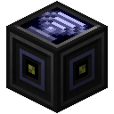
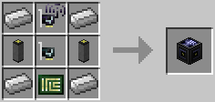

# Access Point

**Deprecated**

**This item is no longer craftable. Note it will not be removed from the world if you already have one**

The Access Point is an improved version of the [switch](switch.md). It allows for the same functionality and more: it also receives and relays wireless messages! It converts wireless messages into wired ones and vice versa, given its signal strength is not set to zero. For example, placing an Access Point next to a computer with a normal network card will allow it to send network messages to another computer with a wireless network card that is in range of the access point, as well as receive messages from it.

The Access Point is crafted using the following recipe:
  * 4 x Iron Ingot
  * 2 x [Cable](cable.md)
  * 1 x [Wireless Network Card](../item/wireless_network_card.md)
  * 1 x [Network Card](../item/network_card.md)
  * 1 x [Printed Circuit Board](../item/materials.md)

## Contents
