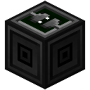
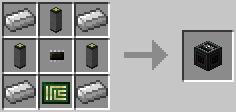

# Adapter

Used to control non-component blocks, such as vanilla blocks or blocks from other mods. ~~You will most likely also install [OpenComponents](https://github.com/MightyPirates/OpenComponents) to make this block more useful.~~

This block allows interfacing with all kinds of blocks, as long as a driver is made available to OpenComputers. For example, ~~OpenComponents~~ OpenComputers comes with such drivers for the vanilla Command Block and Note Block, as well as drivers for a bunch of tech mods such as BuildCraft IndustrialCraft2 and ThermalExpansion. ~~OpenComponents~~ OpenComputers will also allow the Adapter to interface with most ComputerCraft peripherals.

If you're a modder it's pretty easy to write a driver, you just have to implement the corresponding interface from the API and register it with OpenComputers in the init phase. ~~Have a look at the implementation of OpenComponents, if you find [the documentation](https://github.com/MightyPirates/OpenComputers/tree/master/src/main/java/li/cil/oc/api) in the interfaces is insufficient.~~ Have a look at existing implementations within [OpenComputers](https://github.com/MightyPirates/OpenComputers/tree/master-MC1.8/src/main/scala/li/cil/oc/integration) if you find the documentations in the interfaces is insufficient.

The Adapter is crafted using the following recipe:
  * 4 x Iron Ingot
  * 3 x [Cable](cable.md)
  * 1 x [Microchip (Tier 1)](../item/materials.md)
  * 1 x [Printed Circuit Board](../item/materials.md)

## Contents
