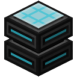
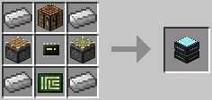
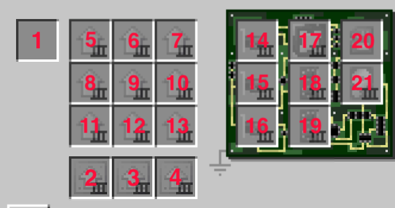

# Assembler

This machine is used to assemble a robot from its individual parts. You can configure your robot in a lot of detail here, but keep in mind that most parts will be fixed once the robot is assembled, so choose wisely. Assembly takes a short amount of time, but consumes a good bit of energy.

For a basic robot you will generally want to add the parts you also use to build a computer, i.e. a CPU, RAM, a medium with an operating system on it, and unless you want a "headless" robot, a screen, a keyboard and a GPU.

*Since version 1.3.*

The Assembler is crafted using the following recipe:
  * 4 x Iron Ingot
  * 1 x Crafting Table
  * 2 x Piston (or Sticky Piston)
  * 1 x [Microchip (Tier 2)](../item/materials.md)
  * 1 x [Printed Circuit Board](../item/materials.md)

Here's a map to the component slots for assembly automation:

The red numbers on the image seen above are the same for all of the assembly cases.

## Contents
