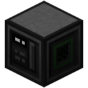
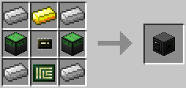

# Charger

Transfers energy from capacitors into adjacent robots. The transfer rate depends on the incoming redstone signal, where no signal means don't charge robots, and maximum strength means charge at full speed.

You'll need one of these to get your robots running. There is the [generator upgrade](../item/generator_upgrade.md), but you can only put fuel into the generator via the API, meaning you have to get *some* energy into your robot some other way, first. And that way is the Charger block.

The Charger is crafted using the following recipe:
  * 2 x [Capacitor](capacitor.md)
  * 1 x [Microchip (Tier 2)](../item/materials.md)
  * 4 x Iron ingot
  * 1 x Gold ingot
  * 1 x [Printed Circuit Board](../item/materials.md)

## Contents
