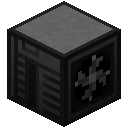
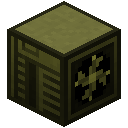
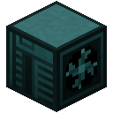
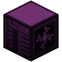
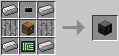
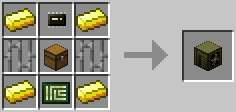
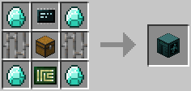

# Computer Case
The Computer Case. Like their real-life counterparts, they house all of the components that make the computer *run*.

In OpenComputers the cases come in four tiers of which only 3 are craftable in survival. Each with better specs than the last. Below are the styles of the case tiers.

   

## Tier 1
The first tier of case, cannot support much but it is a good starting point nonetheless.
Tier 1 cases provide room for:

- 1 x [EEPROM](../item/eeprom.md)
- 1 x Tier 1 [Processor](../item/cpu.md)
- 2 x Tier 1 [RAM Modules](../item/memory.md)
- 1 x Tier 1 [HDD](../item/hard_disk_drive.md)
- 2 x Tier 1 [Expansion Cards](../item/expansion_card.md)

Tier 1 cases are crafted with:
  * 4 x Iron Ingot
  * 2 x Iron Bars
  * 1 x Chest
  * 1 x [Microchip](../item/materials.md#microchips)
  * 1 x [Printed Circuit Board](../item/materials.md#printed-circuit-board)

## Tier 2
The second tier of case, can do more than Tier 1 but not as much as Tier 3.
Tier 2 cases provide room for:

- 1 x [EEPROM](../item/eeprom.md)
- 1 x Tier 2 [Processor](../item/cpu.md)
- 2 x Tier 2 [RAM Modules](../item/memory.md)
- 1 x Tier 1 [HDD](../item/hard_disk_drive.md)
- 1 x Tier 2 [HDD](../item/hard_disk_drive.md)
- 1 x Tier 1 [Expansion Card](../item/expansion_card.md)
- 1 x Tier 2 [Expansion Card](../item/expansion_card.md)

Tier 2 cases are crafted with:
  * 4 x Gold Ingot
  * 2 x Iron Bars
  * 1 x Chest
  * 1 x [Microchip (Tier 2)](../item/materials.md#microchips)
  * 1 x [Printed Circuit Board](../item/materials.md#printed-circuit-board)

## Tier 3
The third tier of case, can pretty much do anything you want it to do.
Tier 3 cases provide room for:

- 1 x [EEPROM](../item/eeprom.md)
- 1 x Tier 3 [Processor](../item/cpu.md)
- 2 x Tier 3 [RAM Modules](../item/memory.md)
- 1 x Tier 2 [HDD](../item/hard_disk_drive.md)
- 1 x Tier 3 [HDD](../item/hard_disk_drive.md)
- 2 x Tier 2 [Expansion Cards](../item/expansion_card.md)
- 1 x Tier 3 [Expansion Card](../item/expansion_card.md)
- 1 x [Floppy Disk](../item/floppy_disk.md)

Tier 3 cases are crafted with:
  * 4 x Diamonds
  * 2 x Iron Bars
  * 1 x Chest
  * 1 x [Microchip (Tier 3)](../item/materials.md#microchips)
  * 1 x [Printed Circuit Board](../item/materials.md#printed-circuit-board)

## Tier 4 (Creative)
The fourth tier of case, cannot be crafted in survival and only cheated in using the Creative Inventory or NEI.
Tier 4 cases provide room for:

- 1 x [EEPROM](../item/eeprom.md)
- 1 x Tier 3 [Processor](../item/cpu.md)
- 2 x Tier 3 [RAM Modules](../item/memory.md)
- 2 x Tier 3 [HDD](../item/hard_disk_drive.md)
- 3 x Tier 3 [Expansion Cards](../item/expansion_card.md)
- 1 x [Floppy Disk](../item/floppy_disk.md)

Can be spawned with the command "/oc\_sc". It will spawn a creative case with a tier 3 hard drive, 2x tier 3.5 RAM sticks, a creative [APU](../item/apu.md), and an [OpenOS floppy disk](../item/openos_floppy.md). It will also spawn with a tier 2 monitor/screen with a keyboard on top. To spawn this on multiplayer, you need at-least level 2 OP. You can spawn this in single player without problems.

## Contents
