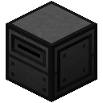
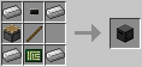

# Disk Drive

Allows reading and writing [floppies](../item/floppy.md). ComputerCraft floppies are also supported.

The main use of floppies - except being cheaper than hard drives - is to get data onto robots, since they cannot connect to external components, and only have a component slot for floppies, but not for hard drives. If you have the materials, you can build a tier three case, which has a built-in disk drive. Until then, this block is your new best friend.

The Disk Drive is crafted using the following recipe:
  * 4 x Iron ingot
  * 1 x Piston
  * 1 x Stick
  * 1 x [Microchip (Tier 1)](../item/materials.md)
  * 1 x [Printed Circuit Board](../item/materials.md)

## Contents
