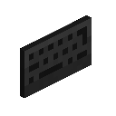
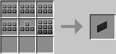

# Keyboard

Can be attached to [screens](screen.md) to allow typing on them. Note that keyboards will only work on screens they are placed on or point towards.

For multi-block screens it can very much matter *where* on the screen you place the keyboard, since you have to be within range of the keyboard to type - meaning you may be able to open the screen's GUI, but not be able to type.

Note that a screen block for itself is just that. A screen. Displaying stuff. Once you attach a keyboard to it, a GUI will open when you right-click/activate it, allowing text input. Note that tier two and three screens allow "clicking" them in the world directly (by right-clicking/activating them), i.e. a `touch` signal will be generated. They're touch-screens, so to speak. *This only works if they have no keyboard*.

The Keyboard is crafted using the following recipe:
  * 4 x [Button Group](../item/materials.md#keyboard-arrow-keysbutton-groupnumeric-keypad)
  * 1 x [Arrow Keys](../item/materials.md#keyboard-arrow-keysbutton-groupnumeric-keypad)
  * 1 x [Numeric Keypad](../item/materials.md#keyboard-arrow-keysbutton-groupnumeric-keypad)

## Contents
