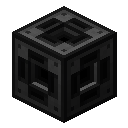
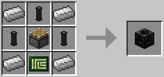

# Net Splitter

Acts as a dynamic connector. Connectivity of each side can be toggled by hitting it with a wrench. Connectivity of all sides can be inverted by applying a redstone signal.

The Net Splitter is crafted using the following recipe:
  * 4 x Iron Ingot
  * 1 x Piston
  * 3 x [Cable](cable.md)
  * 1 x [Printed Circuit Board](../item/materials.md)

## Contents
