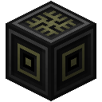
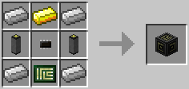

# Power Distributor

Distributes energy between different networks. This can be useful for powering multiple sub-networks that should not connect to each other. For example, you'll usually want to try and keep different computers in different networks - unless you have a startup script on each computer that manually assigns the primary components. Otherwise you'll frequently end up with the computers binding the wrong screen and/or keyboard on startup, for example, or even multiple computer binding to the same screen.

The Power Distributor is crafted using the following recipe:
  * 4 x Iron Ingot
  * 1 x Gold Ingot
  * 2 x [Cable](cable.md)
  * 1 x [Printed Circuit Board](../item/crafting_items.md)

## Contents
