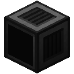
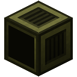
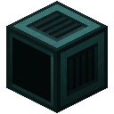
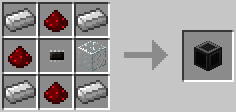
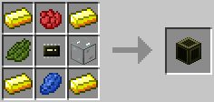
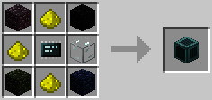

# Screen
  

Display text, controlled by a [Graphics Card](../item/graphics_card.md) in a [Case](case.md).

- Maximum resolution: 50x16/80x25/160x50.
- Maximum color depth: 1/4/8.

Screens allow computers to display text, by binding them on a graphics card and then changing their text buffer. Think of these screens more like... chalk boards. You don't have to send the data to display each "frame", instead you set something to display, and the screen will continue displaying it until it's told to display something else. There are a few scenarios where a screen's buffer will be cleared, though: when they are merged into a multi-block screen, when the controlling computer is turned off, and when they are bound by a graphics card.

Note that screens of all tiers can be controlled by graphics cards of all tiers. However, the minimum capabilities of each combination apply. For example, when using an advanced screen via a basic graphics card, the maximum resolution and color depth will be limited by that of the graphics card.

Tier two and three screens allow mouse input: it generates a `touch` signal on all computers in its network whenever a user either right-clicks/activates the display area of a screen *without* a keyboard - like a giant touch screen - or when left clicking on the display area in the GUI of a screen *with* a keyboard.
They also generate a `walk` signal when a mob moves while walking on the screen.

As of version 1.3, tier 2 screens use a 16 color *palette*, that defaults to the Minecraft colors and can be manipulated as desired. Tier 3 screens have a hybrid color system, where 240 colors are "automatic" and a 16 color palette exists that defaults to different shades of grey, but can also be manipulated as desired.

The Tier 1 Screen is crafted using the following recipe:
  * 4 x Iron Ingot
  * 1 x Glass
  * 1 x [Microchip (Tier 1)](../item/materials.md)
  * 3 x Redstone Dust

The Tier 2 Screen is crafted using the following recipe:
  * 1 x [Microchip (Tier 2)](../item/materials.md)
  * 1 x Rose Red
  * 1 x Cactus Green
  * 1 x Lapis Lazuli
  * 4 x Gold Ingot
  * 1 x Glass

The Tier 3 Screen is crafted using the following recipe:
  * 1 x [Microchip (Tier 3)](../item/materials.md)
  * 4 x Obsidian
  * 1 x Glass
  * 3 x Glowstone Dust

## Contents
