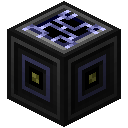
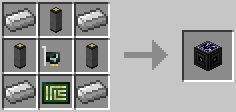

# Relay

The Relay allows connecting different networks to each other. Only network messages will be passed along, components will not be visible through this. Use this to separate networks while still allowing communication using Network Cards. The reasoning is the same as for the [power distributor](power_distributor.md) not connecting its adjacent networks: you may often wish to keep your sub-networks separate. This allows computers in different sub-networks to communicate without having to go all out and use wireless networks.

Note that relays have a limited bandwidth. They will only transfer one packet per 5 ticks (250ms) and their internal queue is limited to 20 packets. If you exceed this limit you will experience dropped packets. Also note that packets can be relayed no more than 5 times. After that the packet is dropped. These limits can be increased by adding a CPU, RAM, or a hard disc drive to the router.

  * No CPU: 4 Hz (4 cycles per second)
  * Tier 1 CPU: 5 Hz
  * Tier 2 CPU: 10 Hz
  * Tier 3 CPU: 20 Hz

  * No RAM: 1 packet per cycle
  * Tier 1 RAM: 2 packet per cycle
  * Tier 1.5 RAM: 3 packets per cycle
  * Tier 2 RAM: 4 packets per cycle
  * Tier 2.5 RAM: 5 packets per cycle
  * Tier 3 RAM: 6 packets per cycle
  * Tier 3.5 RAM: 7 packets per cycle

  * No HDD: queue size 20
  * Tier 1 HDD: queue size 30
  * Tier 2 HDD: queue size 40
  * Tier 3 HDD: queue size 50

Relays will not route packets back where they came from, but it is still possible to generate loops where packets will then arrive multiple times, so keep that in mind.

A Wireless or Linked Relay may be created by first right-clicking on the Relay, and inserting a Wireless or Linked Card into the resultant GUI.

The Relay block also serves as a ComputerCraft peripheral, providing an interface imitating that of ComputerCraft's (wired) modems. It will forward network messages sent from ComputerCraft to the OpenComputers side, which can be received if a [network card](../item/lan_card.md) is installed. It will also receive OpenComputers' network messages and push a corresponding signal in CC computers attached to the adapter. Note that network messages in OpenComputers do not require a "response port" like ComputerCraft does. If the first argument for the network message is a number, it will be interpreted as the response port to tell ComputerCraft receivers, otherwise the response port will be set to `-1`.
*Note*: this functionality was available via the Adapter block before 1.1.0.

The Relay is crafted using the following recipe:
  * 3 x [Cable](cable.md)
  * 4 x Iron Ingot
  * 1 x [Network Card](../item/network_card.md)
  * 1 x [Printed Circuit Board](../item/materials.md)

## Contents
