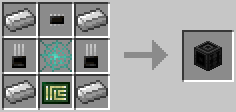

# Waypoint

The waypoint block provides additional functionality for [robots](robot.md) and [drones](../item/drone.md) with a [navigation upgrade](../item/navigation_upgrade.md). The position of the waypoint reported is the block directly in front of the waypoint, as indicated by the particle effects. This allows the waypoint block to be placed above a chest, for instance, to be able to determine the position of the block directly above the chest.

Waypoints can be labeled and provided with a redstone signal. This allows for finer control when writing sorting programs, for instance.

The waypoint block can be located using the `findWaypoints()` function in the [navigation](../component/navigation.md) component. This allows the [robots](robot.md) or [drone](../item/drone.md) to find all waypoints within a certain range; the function returns the label of the waypoint, the position of the waypoint in relative coordinates, as well as the redstone level of the waypoint.

The Waypoint is crafted using the following recipe:
  * 1 x [Interweb](../item/materials.md)
  * 1 x [Printed Circuit Board](../item/materials.md)
  * 2 x [Transistor](../item/materials.md)
  * 4 x Iron ingot

## Contents
