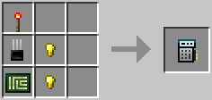

# Analyzer

Used to display information about blocks, such as their address and component name.
Also displays the error that caused a computer to crash if it did not shut down normally.

To use the Analyzer, right click on an OpenComputers block while sneaking (holding the shift key).

Note that if you hold `Ctrl` while analyzing a block, that block's address will be copied to your clipboard (if the block has an address, that is).

The Analyzer is crafted using the following recipe:
  * 2 x Gold nugget/oreberry (with Tinker's Construct)
  * 1 x [Transistor](materials.md)
  * 1 x [Printed Circuit Board](materials.md)
  * 1 x Redstone Torch

## Contents
