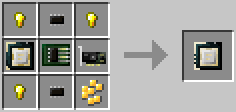
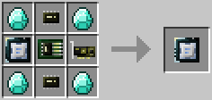

### APU

An APU (or Accelerated Processing Unit) is a combination of a [CPU](cpu.md) and [Graphics card](graphics_card.md), and functions in exactly the same way as having both components individually. The benefit of the APU is that it frees up an expansion slot where a [Graphics card](graphics_card.md) would normally be, allowing for the use of other expansion cards.

The APU (tier 1) is crafted using the following recipe:
  * 1 x [CPU (tier 2)](cpu.md)
  * 1 x [GPU (tier 1)](graphics_card.md)
  * 4 x Gold nugget
  * 1 x [Component Bus (tier 1)](component_bus.md)
  * 2 x [Microchip (tier 1)](materials.md)

The APU (tier 2) is crafted using the following recipe:
  * 1 x [CPU (tier 3)](cpu.md)
  * 1 x [GPU (tier 2)](graphics_card.md)
  * 4 x Diamond
  * 1 x [Component Bus (tier 2)](component_bus.md)
  * 2 x [Microchip (tier 2)](materials.md)

## Contents
