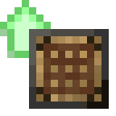
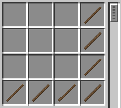
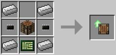

# Crafting Upgrade

**Provides:** Component API [crafting](../component/crafting.md)

Enables robots to use the top left area of their inventory for crafting objects. Items have to be aligned as they would be in a crafting table.

*(free slots are the crafting area)*

The Crafting upgrade is crafted using the following recipe:
  * 1 x Crafting Table
  * 4 x Iron Ingot
  * 2 x [Microchip (Tier 1)](materials.md)
  * 1 x [Printed Circuit Board](materials.md)

## Contents
