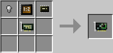
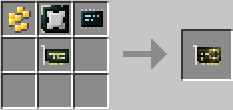
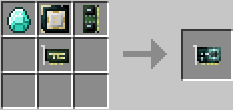

# Data Card

**Provides**: [Data Card](../component/data.md) component.

The data card provides a variety of data encoding and decoding functionality, hashing, encryption and decryption, etc. There is a limit to the size of data that can be passed into any function provided by the data component. The higher the tier of data card, the more functionality is available.  Usage can be found on the [data](../component/data.md) component page.

#### Crafting

The Data card (tier 1) is crafted using the following recipe:
  * Iron nugget/oreberry
  * [Arithmetic Logic Unit (ALU)](materials.md)
  * [Microchip (tier 2)](materials.md)
  * [Card base](materials.md)

The Data card (tier 2) is crafted using the following recipe:
  * Gold nugget/oreberry
  * [CPU (tier 1)](cpu.md)
  * [Microchip (tier 3)](materials.md)
  * [Card base](materials.md)

The Data card (tier 3) is crafted using the following recipe:
  * Diamond
  * [CPU (tier 2)](cpu.md)
  * [Memory (tier 3)](ram.md)
  * [Card base](materials.md)

