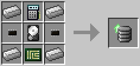
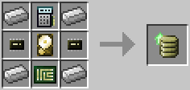
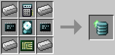

# Database Upgrade

Provides the [database component](../component/database.md).

This upgrade can be used to store item stack information. It can be configured by open its GUI by right clicking holding it in your hand and placing items in it (no actual items are stored in the item, clicking with an item in the grid will store a "ghost" stack). Alternatively, a few components allow configuring the database programmatically, such as the [Inventory Controller Upgrade](inventory_controller_upgrade.md) and the [Geolyzer](../block/geolyzer.md).

The Database Upgrade (Tier 1) is crafted using the following recipe:
  * 4 x Iron Ingot
  * 2 x [Microchip (Tier 1)](materials.md)
  * 1 x [Hard Disk Drive (Tier 1)](hard_disk_drive.md)
  * 1 x [Analyzer](analyzer.md)
  * 1 x [Printed Circuit Board](materials.md)

The Database Upgrade (Tier 2) is crafted using the following recipe:
  * 4 x Iron Ingot
  * 2 x [Microchip (Tier 2)](materials.md)
  * 1 x [Hard Disk Drive (Tier 2)](hard_disk_drive.md)
  * 1 x [Analyzer](analyzer.md)
  * 1 x [Printed Circuit Board](materials.md)

The Database Upgrade (Tier 3) is crafted using the following recipe:
  * 4 x Iron Ingot
  * 2 x [Microchip (Tier 3)](materials.md)
  * 1 x [Hard Disk Drive (Tier 3)](hard_disk_drive.md)
  * 1 x [Analyzer](analyzer.md)
  * 1 x [Printed Circuit Board](materials.md)

## Contents
