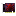

# Debug Card

Provides the [debug component](../component/debug.md).

This item is only available via creative mode, and is not intended for normal play. It provides a variety of functions that should not be used carelessly.

## Contents
