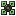
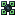
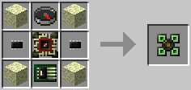
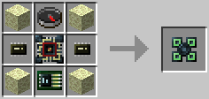

# Drone Case
 

This item is used in an [Assembler](../block/assembler.md) to build [Drones](drone.md), which are kind of to robots what microcontrollers are to computers. They are more limited, specialized versions. In this case they also have some additional functionality, though: they move differently (because they are entities) and have other options for interacting with the world, too, such as via using the [Leash Upgrade](leash_upgrade.md).

The Drone Case (Tier 1) is crafted using the following recipe:
  * 4 x End Stone
  * 1 x [Microcontroller Case (Tier 1)](microcontrollercase.md)
  * 1 x Compass
  * 2 x [Microchip (Tier 1)](materials.md)
  * 1 x [Component Bus (Tier 2)](component_bus.md)

The Drone Case (Tier 2) is crafted using the following recipe:
  * 4 x End Stone
  * 1 x [Microcontroller Case (Tier 2)](microcontrollercase.md)
  * 1 x Compass
  * 2 x [Microchip (Tier 2)](materials.md)
  * 1 x [Component Bus (Tier 3)](component_bus.md)

## Contents
