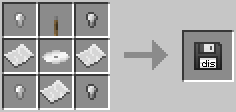

# Floppy Disk

Small and cheap storage device that can be inserted into [disk drives](../block/disk_drive.md), tier three [computer cases](../block/case.md) and [robots](../block/robot.md).

The Floppy Disk is crafted using the following recipe:
  * 3 x Paper
  * 4 x Iron nugget/oreberry (with Tinker's Construct)
  * 1 x [Disk Platter](materials.md)
  * 1 x Lever

The floppy disk can be used to create the [OpenOS Floppy Disk](openos_floppy.md)

## Contents
