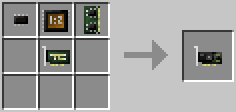
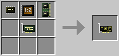
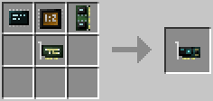

# Graphics Card
  

Used to change what's displayed on screens. Computers can control the buffer of a bound [screen](../block/screen.md) via the [GPU's API](../component/gpu.md).

- Maximum resolution: 50x16/80x25/160x50.
- Maximum color depth: 1/4/8.
- Operations/tick: 1,1,4,2,2/2,4,8,4,4/4,8,16,8,8.

The operations refer to, from left to right: `copy`, `fill`, `set`, `setBackground` and `setForeground`. The number indicates the number *direct* calls that can be made to each of these functions on the graphics card *per tick* before an indirect call has to be made. See the [page on component interaction](../component/component_access.md) for more information on direct calls.

The Graphics Card (Tier 1) is crafted using the following recipe:
  * 1 x [Arithmetic Logic Unit](materials.md)
  * 1 x [Card Base](materials.md)
  * 1 x [Microchip (Tier 1)](materials.md)
  * 1 x [Memory (Tier 1)](memory.md)

The Graphics Card (Tier 2) is crafted using the following recipe:
  * 1 x [Arithmetic Logic Unit](materials.md)
  * 1 x [Card Base](materials.md)
  * 1 x [Microchip (Tier 2)](materials.md)
  * 1 x [Memory (Tier 2)](memory.md)

The Graphics Card (Tier 3) is crafted using the following recipe:
  * 1 x [Arithmetic Logic Unit](materials.md)
  * 1 x [Card Base](materials.md)
  * 1 x [Microchip (Tier 3)](materials.md)
  * 1 x [Memory (Tier 3)](memory.md)

## Contents
