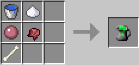

## Grog

Grog is a highly toxic liquid, not suited for consumption. Consuming it can result in undesirable effects, and must be attempted with caution. Primarily, it is a component that is used in hard-mode recipes to make [printed circuit boards](materials.md), which is a base component for many of the components in Open Computers. It is also used in crafting [Nanomachines](nanomachines.md). While under the effect of [Nanomachines](nanomachines.md), consuming Grog will clear the player of any [Nanomachine](nanomachines.md) effects.

#### Crafting

Grog is crafted using the following recipe:
  * Bucket of water
  * Sugar
  * Slimeball
  * Fermented spider eye
  * Bone

