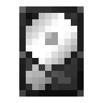
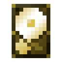
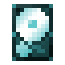
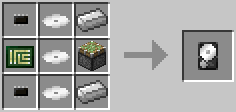
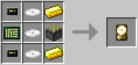
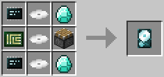

# Hard Disk Drive
  

Hard disk drives (HDDs) come in three tiers, with increasing storage capacity (each tier's capacity is configurable). They can store more data than a simple floppy, but are also more expensive to craft. They can also only be installed in [computer cases](../block/case.md) and [servers](server.md). They can *only* be installed in robots during the assembly phase. (Prior to 1.3: They can *not* be installed in robots.)

The Hard Disk Drive (Tier 1) is crafted using the following recipe:
  * 3 x [Disk Platter](materials.md)
  * 2 x Iron Ingot
  * 2 x [Microchip (Tier 1)](materials.md)
  * 1 x [Printed Circuit Board](materials.md)
  * 1 x Piston

The Hard Disk Drive (Tier 2) is crafted using the following recipe:
  * 3 x [Disk Platter](materials.md)
  * 2 x Gold Ingot
  * 2 x [Microchip (Tier 2)](materials.md)
  * 1 x [Printed Circuit Board](materials.md)
  * 1 x Piston

The Hard Disk Drive (Tier 3) is crafted using the following recipe:
  * 3 x [Disk Platter](materials.md)
  * 2 x Diamond
  * 2 x [Microchip (Tier 3)](materials.md)
  * 1 x [Printed Circuit Board](materials.md)
  * 1 x Piston

## Contents
