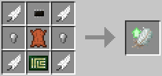
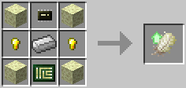

# Hover Upgrade

The Hover upgrade is a [robot](../block/robot.md) upgrade that allows the robot to hover higher above the ground. Normally, a [robot](../block/robot.md) is able to reach a maximum height of 8 blocks, and can also move along walls. The hover upgrade increases that limit to 64 blocks (tier 1) or 256 blocks (tier 2).

The Hover upgrade (tier 1) is crafted using the following recipe:
  * 4 x Feather
  * 2 x Iron nugget
  * 1 x Leather
  * 1 x [Microchip (tier 1)](materials.md)
  * 1 x [Printed Circuit Board](materials.md)

The Hover upgrade (tier 2) is crafted using the following recipe:
  * 4 x [End Stone](materials.md)
  * 2 x Gold nugget
  * 1 x Iron Ingot
  * 1 x [Microchip (tier 2)](materials.md)
  * 1 x [Printed Circuit Board](materials.md)

## Contents
