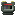
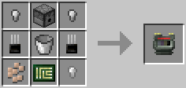
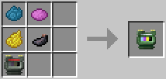

# Ink Cartridge

The Ink Cartridge is an item used in [3D Printers](../block/3d_printer.md), to print various blocks defined by `.3dm` files. The amount of ink used depends on the surface area of the block being printed.

The Ink Cartridge is crafted using the following recipes, first by crafting an Empty Ink Cartridge, followed by crafting the Ink Cartridge with various dyes:

**Ink Cartridge (Empty)**:
  * 4 x Iron nugget/oreberry (with Tinker's Construct)
  * 1 x Dispenser
  * 2 x [Transistor](materials.md)
  * 1 x Bucket
  * 1 x [Printed Circuit Board](materials.md)

**Ink Cartridge**:
  * 1 x Ink Cartridge (Empty)
  * 1 x Cyan Dye
  * 1 x Magenta Dye
  * 1 x Dandelion Yellow
  * 1 x Ink Sac

## Contents
