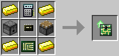

# Inventory Controller Upgrade

**Provides:** Component API [Inventory Controller](../component/inventory_controller.md)

This upgrade allows the robot to interact in a more controlled fashion with inventories in the world.

Robots with this upgrade can read additional item information, suck and drop items from and into specific slots of an inventory and equip items on their own. This is particularly useful for interacting with advanced machines, where items have to go into specific slots, but can also come in handy for sorting systems or automated crafting.

*Since version 1.3.*

The Inventory Controller upgrade is crafted using the following recipe:
  * 4 x Gold Ingot
  * 1 x Piston
  * 1 x Dropper
  * 1 x [Analyzer](analyzer.md)
  * 1 x [Microchip (Tier 2)](materials.md)
  * 1 x [Printed Circuit Board](materials.md)

## Contents
