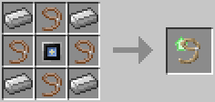

# Leash Upgrade

**Provides:** [Leash](../component/leash.md) component.

This upgrade allows certain devices (such as drones) to put animals on a leash. When leashed the device can pull the animals around, and even pull them up in the air. The leash will persist until it is manually released.

The Leash Upgrade is crafted using the following recipe:
  * 4 x Leash
  * 4 x Iron Ingot
  * 1 x [Control Unit](materials.md)

## Contents
