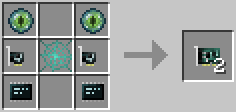

# Linked Card

This card provides the [tunnel](../component/tunnel.md) component.

This card is crafted in pairs. The two resulting cards are "linked", and can communicate with each other over any distance, even across dimensions. They behave similar to network cards, except that no port has to be opened. They also consume more energy per sent packet.

You can recraft any 2 linked card and pair them together, creating a new link channel. You can get the current channel of a linked card either via its component api `getChannel`, or from the item data `linkChannel` using an [inventory controller](../component/inventory_controller.md).

The Linked Card is crafted using the following recipe:
  * 2 x Eye of Ender
  * 2 x [Network Card](network_card.md)
  * 2 x [Microchip (Tier 3)](materials.md)
  * 1 x [Interweb](materials.md)

## Contents
