# Crafting Materials

The following items are used to create basic and intermediate components for many of the components used to build [Computers](../block/computer_case.md), [Servers](../block/server_rack.md), [Robots](../block/robot.md), and [Drones](drone.md).

### Basic Components

Basic components are made of vanilla Minecraft components, and are used in creating intermediate components. A combination of basic and intermediate components are used in creating all of the various blocks and items available in OpenComputers.

#### Raw Circuit Board

Raw Circuit Boards (8x) are made using:
  * 1 x Clay
  * 1 x Gold Ingot
  * 1 x Cactus Green

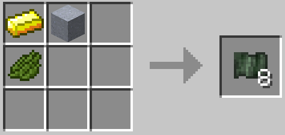

#### Printed Circuit Board

Printed Circuit Boards are made from smelting Raw Circuit Boards in a furnace.

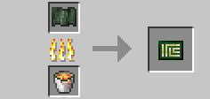

#### Transistor

Transistors (8x) are crafted using the following recipe:
  * 3 x Iron Ingot
  * 2 x Gold nugget/oreberry
  * 1 x Redstone
  * 1 x Paper

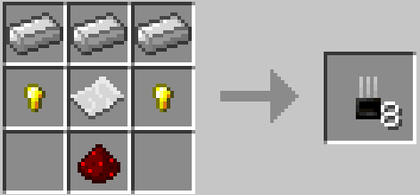

#### Interweb

The Interweb is made using the following recipe:
  * 1 x Ender pearl
  * 8 x String

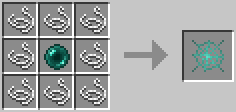

#### End Stone

End Stone (OpenComputers version) is made using the following recipe:
  * 5 x Ender pearl
  * 4 x Chamelium block

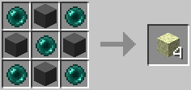

#### Disk Platter

The Disk Platter is made using the following recipe:
  * 4 x Iron nugget/oreberry

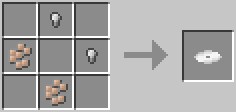

#### Cutting Wire

Cutting Wire is made using:
  * 2 x Stick
  * 1 x Iron Ingot

[Stick, Iron Nugget, Stick]

#### Diamond Chip

Diamond Chips (6x) are made using:
  * 1 x [Cutting Wire](materials.md#cutting-wire)
  * 1 x Diamond

#### Keyboard Arrow Keys/Button Group/Numeric Keypad

All of the following recipes use Stone buttons to create the [Keyboard](../block/keyboard.md) components.

Arrow keys:

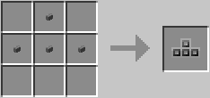

Button group:

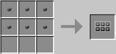

Numeric keypad:

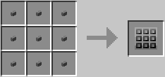

#### Chamelium

Chamelium is a material used in 3D Printers, and is made using the following recipe:
  * 4 x Gravel
  * 1 x Charoal
  * 3 x Redstone
  * 1 x Bucket of Water

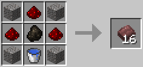

### Intermediate Components

Intermediate components are made from basic components, as well as vanilla Minecraft components.

#### Microchips

The Tier 1 Microchip is crafted (8x) using the following recipe:
    * 1 x [Transistor](materials.md#transistor)
    * 2 x Redstone
    * 6 x Iron nugget/oreberry

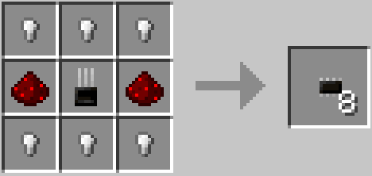

The Tier 2 Microchip is crafted (4x) using the following recipe:
    * 1 x [Transistor](materials.md#transistor)
    * 2 x Redstone
    * 6 x Gold nugget/oreberry

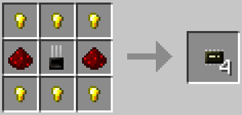

The Tier 3 Microchip is crafted (2x) using the following recipe:
    * 1 x [Transistor](materials.md#transistor)
    * 2 x Redstone
    * 6 x [Diamond Chip](materials.md#diamond-chip)

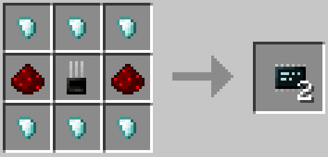

#### Card Base

The Card Base is a key component in making various expansion cards, such as [Graphics Cards](graphics_card.md), [Network Cards](network_card.md), [Linked Cards](linked_card.md), etc.

The following recipe is used in crafting the Card Base:
  * 1 x [Printed Circuit Board](materials.md#printed-circuit-board)
  * 3 x Iron nugget/oreberry
  * 1 x Gold nugget/oreberry

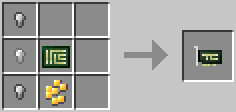

#### Control Unit (CU)

The Control Unit is crafted using the following recipe:
    * 1 x Clock
    * 1 x Redstone
    * 3 x [Transistor](materials.md#transistor)
    * 4 x Gold nugget/oreberry

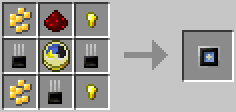

#### Arithmetic Logic Unit

The Arithmetic Logic Unit is crafted using the following recipe:
  * 1 x [Microchip (Tier 1)](materials.md#microchips)
  * 1 x Redstone
  * 3 x [Transistor](materials.md#transistor)
  * 4 x Iron nugget/oreberry

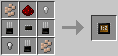

## Contents
