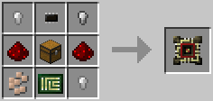
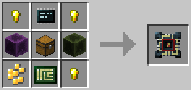

# Microcontroller Case
 

This item is used in an [Assembler](../block/assembler.md) to build [Microcontrollers](../block/microcontroller.md), which are essentially cheaper and minimalistic computers, intended for special use-cases, such as redstone control.

## Tier 1
The Microcontroller case (Tier 1) can house the following components (up to the specified tier):
  * 1 x [CPU (Tier 1)](cpu.md)
  * 1 x [Memory (Tier 1)](memory.md)
  * 1 x [EEPROM](eeprom.md)
  * 2 x Expansion card (Tier 1)
  * 1 x Upgrade (Tier 2)

The Microcontroller Case (Tier 1) is crafted using the following recipe:
  * 4 x Iron nugget/oreberry (with Tinker's Construct)
  * 2 x Redstone dust
  * 1 x Chest
  * 1 x [Printed Circuit Board](materials.md)
  * 1 x [Microchip (Tier 1)](materials.md)

## Tier 2
The Microcontroller case (Tier 2) can house the following components (up to the specified tier):
  * 1 x [CPU (Tier 1)](cpu.md)
  * 2 x [Memory (Tier 1)](memory.md)
  * 1 x [EEPROM](eeprom.md)
  * 1 x Expansion card (Tier 1)
  * 1 x Expansion card (Tier 2)
  * 1 x Upgrade (Tier 3)

The Microcontroller case (Tier 2) is crafted using the following recipe:
  * 4 x Gold nugget/oreberry (with Tinker's Construct)
  * 2 x Block of Redstone
  * 1 x Chest
  * 1 x [Printed Circuit Board](materials.md)
  * 1 x [Microchip (Tier 3)](materials.md)

## Tier 4 (Creative)

The Creative Microcontroller case can house the following components (up to the specified tier):
  * 1 x [CPU (Tier 3)](cpu.md)
  * 3 x Expansion slot (Tier 3)
  * 2 x [Memory (Tier 3)](memory.md)
  * 1 x [EEPROM](eeprom.md)
  * 9 x Upgrades (Tier 3)

## Contents
