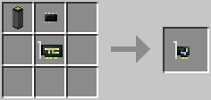

# Network Card

Allows distant computers connected by other blocks (such as cable) to communicate by sending messages to each other.

See the [network card component's API](../component/modem.md) to see how to send and receive messages.

The Network Card is crafted using the following recipe:
  * 1 x [Cable](../block/cable.md)
  * 1 x [Microchip (Tier 1)](materials.md)
  * 1 x [Card Base](materials.md)

## Contents
