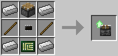

### Piston Upgrade

Provides the [piston component](../component/piston.md).

The piston upgrade can be used to push blocks in the world, in a pretty much identical manner to the way vanilla pistons push blocks.

The Piston Upgrade is crafted using the following recipe:
  * 4 x Iron Ingot
  * 2 x Stick
  * 1 x Piston
  * 1 x [Printed Circuit Board](materials.md)
  * 1 x [Microchip (Tier 1)](materials.md)

## Contents
