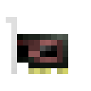
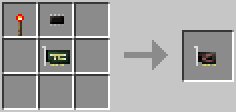
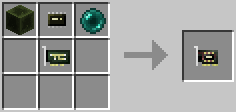

# Redstone Card

Allows reading and emitting redstone signals around the computer or robot. This uses [the same API](../component/redstone.md) as the [Redstone I/O block](../block/redstone_io.md).

The second tier of this card allows interaction with other mods' redstone extensions. If the respective mods are also installed, this supports simple and bundled redstone signals for RedLogic and/or MineFactory Reloaded's RedNet. It also supports wireless redstone interaction with both the Chickenbones and the SlimeVoid versions of Wireless Redstone.

The Redstone Card (Tier 1) is crafted using the following recipe:
  * 1 x Redstone Torch
  * 1 x [Microchip (Tier 1)](materials.md)
  * 1 x [Card Base](materials.md)

The Redstone Card (Tier 2) is crafted using the following recipe:
  * 1 x Block of Redstone
  * 1 x Ender Pearl
  * 1 x [Microchip (Tier 2)](materials.md)
  * 1 x [Card Base](materials.md)

## Contents
