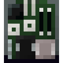
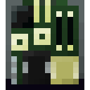
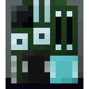
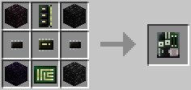
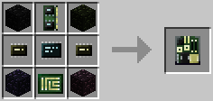
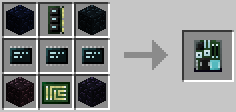

# Server
  

A Server can contain components like a Computer Case. Open a Server by having it selected in your hotbar and rightclicking (like opening an Ender Pouch, for example). A configured server can be placed into a [server rack](../block/rack.md), where it can then be powered on and perform like a normal computer. Servers can be controlled using a Remote Terminal, which will act like a portable Screen+Keyboard combo for the server.

The Server (Tier 1) can be crafted using the following recipe:
  * 4 x Obsidian
  * 1 x [Memory (Tier 2.5)](memory.md)
  * 1 x [Microchip (Tier 2)](materials.md)
  * 2 x [Microchip (Tier 1)](materials.md)
  * 1 x [Printed Circuit Board](materials.md)

The Server (Tier 2) can be crafted using the following recipe:
  * 4 x Obsidian
  * 1 x [Memory (Tier 3)](memory.md)
  * 1 x [Microchip (Tier 3)](materials.md)
  * 2 x [Microchip (Tier 2)](materials.md)
  * 1 x [Printed Circuit Board](materials.md)

The Server (Tier 3) can be crafted using the following recipe:
  * 4 x Obsidian
  * 1 x [Memory (Tier 3.5)](memory.md)
  * 3 x [Microchip (Tier 3)](materials.md)
  * 1 x [Printed Circuit Board](materials.md)

## Contents
