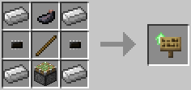

# Sign I/O Upgrade

**Provides**: [sign](../component/sign.md) component.
Allows the robot to read and write signs in the world.

The Sign I/O Upgrade is crafted using the following recipe:
  * 4 x Iron Ingot
  * 1 x Stick
  * 1 x Ink Sac
  * 2 x [Microchip (Tier 1)](materials.md)
  * 1 x Sticky Piston

## Contents
