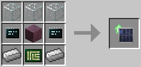

# Solar Generator Upgrade

Generates a little bit of energy during the day if the robot is under clear skies.

The Solar Generator Upgrade is crafted using the following recipe:
  * 3 x Glass
  * 1 x Lapis Lazuli Block
  * 2 x [Microchip (Tier 3)](materials.md)
  * 2 x Iron Ingot
  * 1 x [Printed Circuit Board](materials.md)

## Contents
