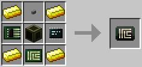
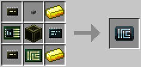

# Tablet Case

Tablet cases are used to build [tablets](tablet.md), which are handheld computers. A creative tablet case also exists for playing around with different configurations in Creative mode.

Tablets take a limited subset of upgrades, unlike Robots. Tablets also have access to only one upgrade or card container slot (Tier 2 and Creative).

## Tier 1

The Tier 1 Tablet case supports the following components (tiers indicate the maximum tier of component the case can take):
  * 1 x [CPU (tier 2)](cpu.md)
  * 2 x [Memory (tier 2)](memory.md)
  * 1 x [HDD (tier 2)](hard_disk_drive.md)
  * 2 x Expansion slot (Tier 2)
  * 1 x [EEPROM](eeprom.md)
  * 1 x Upgrade (Tier 1)
  * 1 x Upgrade (Tier 2)
  * 1 x Upgrade (Tier 3)

The Tier 1 Tablet case can be crafted using the following recipe:
  * 1 x [Screen (Tier 2)](../block/screen.md)
  * 4 x Gold ingot
  * 1 x Button
  * 1 x [Component Bus (Tier 1)](component_bus.md)
  * 1 x [Printed Circuit Board](materials.md)
  * 1 x [Microchip (Tier 3)](materials.md)

## Tier 2

The Tier 2 Tablet case supports the following components:
  * 1 x [CPU (tier 3)](cpu.md)
  * 2 x [Memory (tier 2)](memory.md)
  * 1 x [HDD (tier 2)](hard_disk_drive.md)
  * 1 x Expansion slot (Tier 2)
  * 1 x Expansion slot (Tier 3)
  * 1 x [EEPROM](eeprom.md)
  * 2 x Upgrade (Tier 2)
  * 1 x Upgrade (Tier 3)
  * 1 x Upgrade/Card container (Tier 2)

The Tier 2 Tablet case can be crafted using the following recipe:
  * 1 x [Screen (Tier 2)](../block/screen.md)
  * 2 x Gold ingot
  * 1 x Button
  * 1 x [Component Bus (Tier 3)](component_bus.md)
  * 1 x [Printed Circuit Board](materials.md)
  * 1 x [Microchip (Tier 3)](materials.md)
  * 2 x [Microchip (Tier 2)](materials.md)

## Tier 4 (Creative)

The creative Tablet case supports the following components:
  * 1 x [CPU (tier 3)](cpu.md)
  * 2 x [Memory (tier 3)](memory.md)
  * 1 x [HDD (tier 3)](hard_disk_drive.md)
  * 3 x Expansion slot (Tier 3)
  * 1 x [EEPROM](eeprom.md)
  * 9 x Upgrade (Tier 3)
  * 1 x Upgrade/Card container (Tier 3)

## Contents
