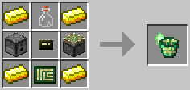

# Tank Controller Upgrade

**Provides:** [Tank Controller](../component/tank_controller.md) API.

This upgrade allows filling or draining fluid container items within the robot's inventory, as well as inspecting fluid stacks. A [Tank Upgrade](tank_upgrade.md) is recommended for this upgrade to be of proper use, as it operates on the selected internal tanks when draining or filling fluid container items.

The Tank Controller Upgrade is crafted using the following recipe:
  * 4 x Gold Ingot
  * 1 x Glass Bottle
  * 1 x Dispenser
  * 1 x Piston
  * 1 x [Microchip (Tier 2)](materials.md)
  * 1 x [Printed Circuit Board](materials.md)

## Contents
