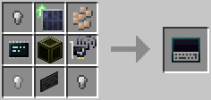

# Remote Terminal

The Remote Terminal can be bound to a single [terminal server](terminal_server.md), to allow controlling it from anywhere within the range configured in the [server rack](../block/rack.md) containing the terminal server.

The Remote Terminal is crafted using the following recipe:
  * 4 x Iron nugget/oreberry (with Tinker's Construct)
  * 1 x [Screen (Tier 2)](../block/screen.md)
  * 1 x [Wireless Network Card (Tier 2)](wireless_network_card.md)
  * 1 x [Microchip (Tier 3)](materials.md)
  * 1 x [Keyboard](../block/keyboard.md)
  * 1 x [Solar Generator Upgrade](solar_generator_upgrade.md)

## Contents
