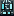
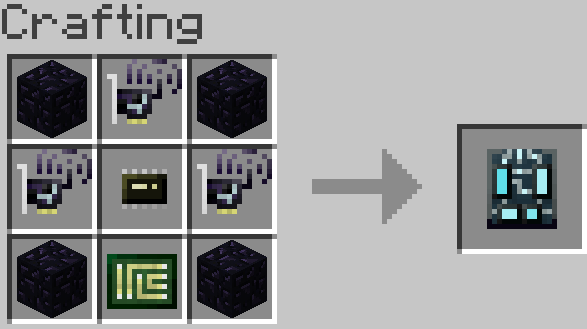

# Terminal Server

The Terminal Server can be bound to [remote terminals](terminal.md) which provides a remote accessible tier 3 screen and keyboard. Terminal servers are blades that fit in [racks](../block/server_rack.md), and need to share a configured side (see the rack gui) with a server blade to be connected. Terminal servers have a range limit equal to a tier 2 wireless card.

The Terminal Server is crafted using the following recipe:
  * 4 x Obsidian Block
  * 1 x [Wireless Network Card (Tier 2)](wireless_network_card.md)
  * 1 x [Microchip (Tier 2)](materials.md)
  * 1 x Printed Circuit Board

## Contents
