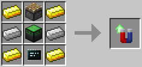

# Tractor Beam Upgrade

Allows robots to pick up items in their vicinity, not just directly in front of/above/below them using the [provided API](../component/tractor_beam.md).

*Added in OC 1.3.2.*

The Tractor Beam Upgrade is crafted using the following recipe:
  * 4 x Gold Ingot
  * 2 x Iron Ingot
  * 1 x Capacitor
  * 1 x Piston
  * 1 x [Microchip (Tier 3)](materials.md)

## Contents
