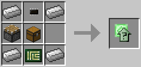
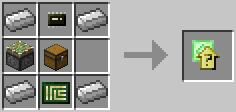
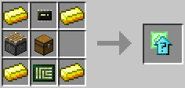

# Upgrade Container
  

This upgrade provides an upgrade slot supporting an upgrade up the tier of the container. For example, a tier two upgrade container can take a tier two upgrade.

*Since version 1.3.*

The Upgrade Container (Tier 1) is crafted using the following recipe:
  * 4 x Iron Ingot
  * 1 x Piston
  * 1 x Chest
  * 1 x [Microchip (Tier 1)](materials.md)
  * 1 x [Printed Circuit Board](materials.md)

The Upgrade Container (Tier 2) is crafted using the following recipe:
  * 4 x Iron Ingot
  * 1 x Piston
  * 1 x Chest
  * 1 x [Microchip (Tier 2)](materials.md)
  * 1 x [Printed Circuit Board](materials.md)

The Upgrade Container (Tier 3) is crafted using the following recipe:
  * 4 x Gold Ingot
  * 1 x Piston
  * 1 x Chest
  * 1 x [Microchip (Tier 2)](materials.md)
  * 1 x [Printed Circuit Board](materials.md)

## Contents
