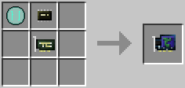

# World Sensor Upgrade

**Provides**: [World Sensor](../component/world_sensor.md) component.

Allows the robot or drone to obtain atmospheric and gravitational information about the world it is in, which is particularly useful for operating devices on planets added by Galacticraft.

The World Sensor upgrade is crafted using the following recipe:
  * 1 x Sensor Lens (from Galacticraft)
  * 2 x [Microchip (Tier 2)](materials.md)
  * 1 x [Card Base](materials.md)

## Contents
